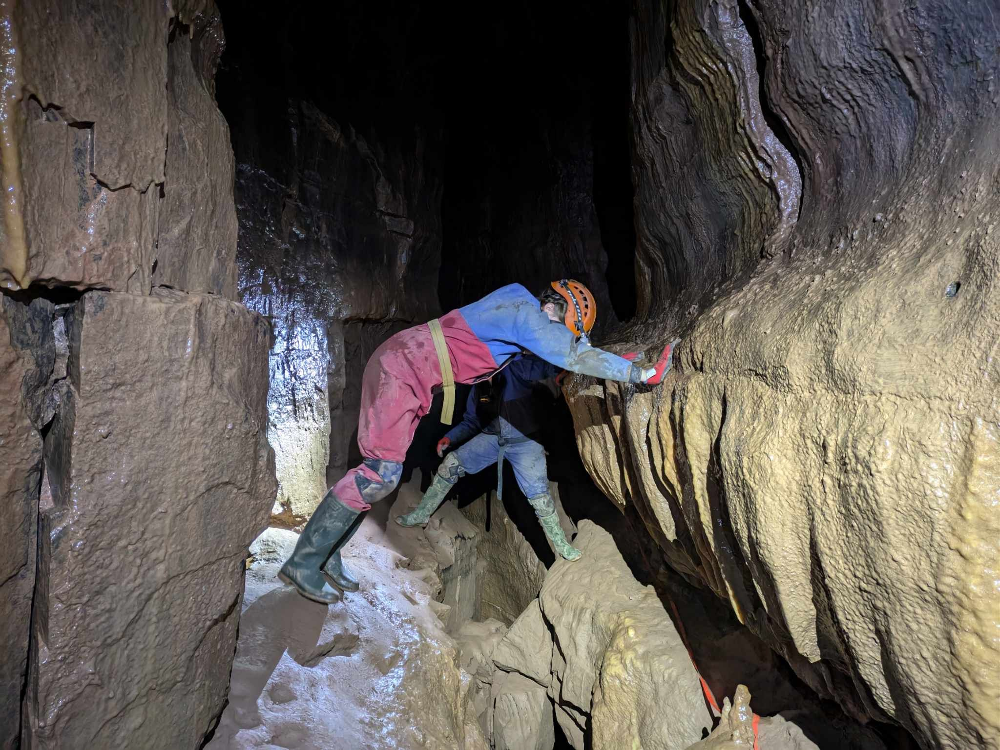
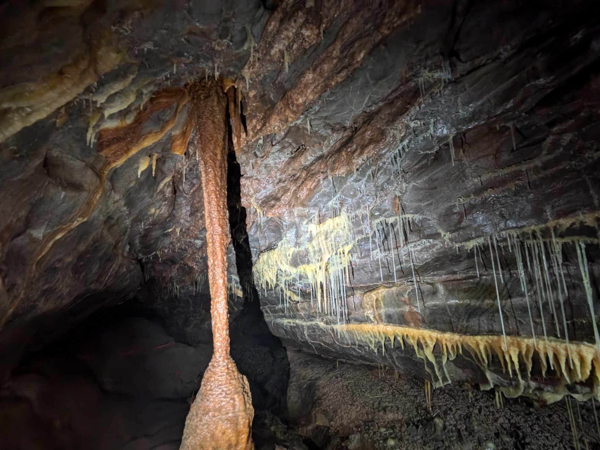
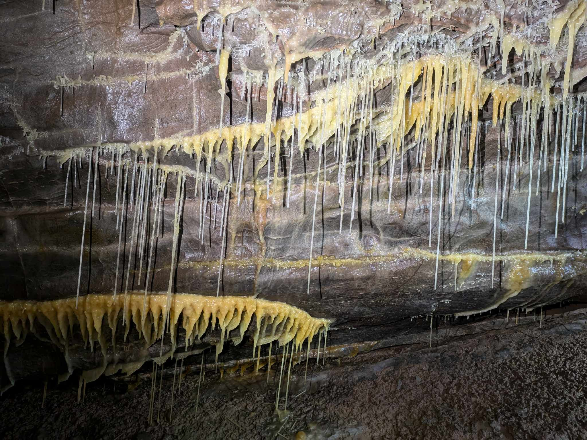
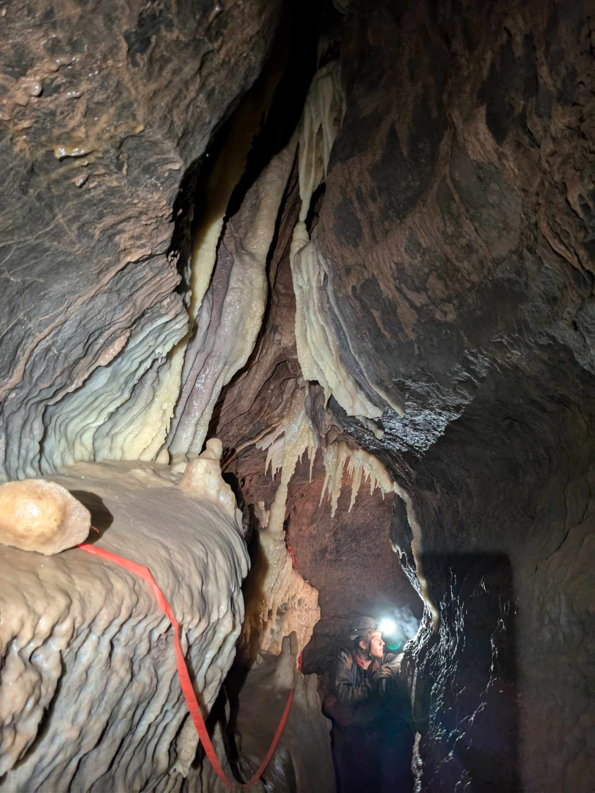
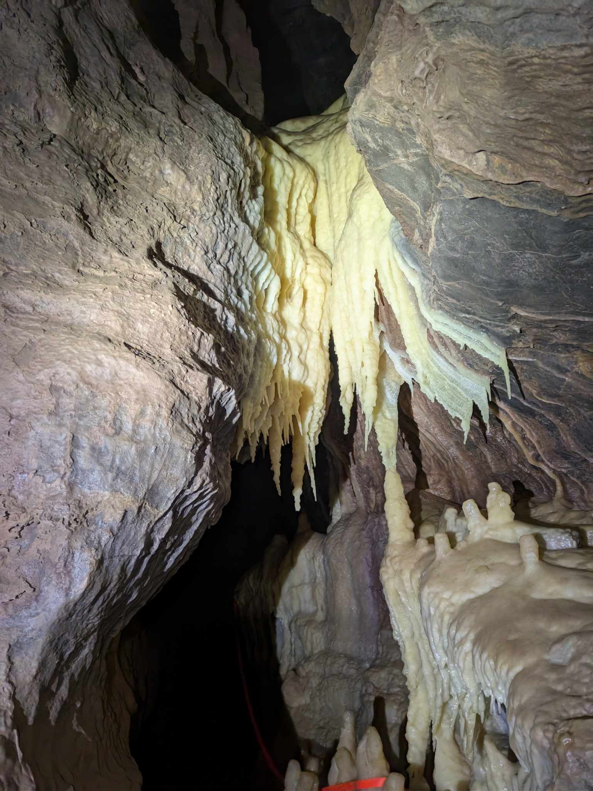
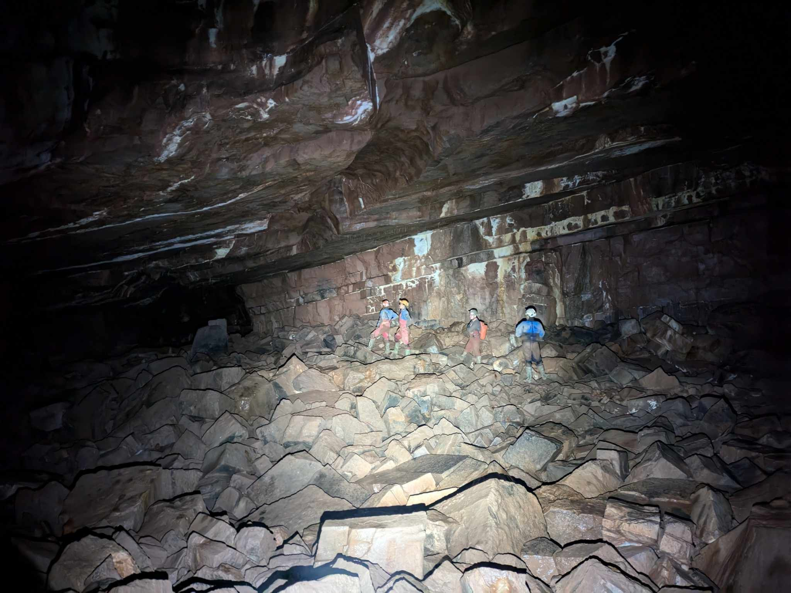

<link rel="stylesheet" href="styles.css">
## 2nd January 2025: Frozen River, Ogof Ffynnon Ddu

**People**: Sarah, Luke, Danny, Lizzy, Callum

    

        
    

    

        
    

    

        
    

    

        
    

    

        
    

    

        
    

    

        
    

    

        
    

